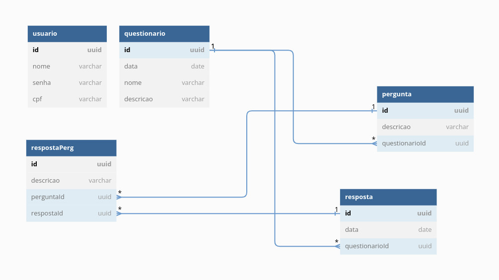

<h1 align="center">Enquetes App</h1>

## Sobre

Enquetes App é uma aplicação para criar e responder questionários.

Esse projeto inclui: API e Web App

## Tecnologias

- React
- NextJs
- NestJs
- Typescript
- Google Cloud Functions
- Netlify

## Diagrama do modelo de dados



Houve alterações no diagrama:

- Um Questionário tem muitas Perguntas e muitas Respostas
- Uma Resposta tem muitos items de resposta
- Uma Pergunta tem muitos item de resposta
- Um Usuário cria muitos questionários e responde a muitas respostas

## Acesso ao sistema

### URLS

- https://enquetes-function-t4ptokxoba-uc.a.run.app/ (cloud function - backend)

**Importante:** deve-se esperar um tempo para a cloud function rodar completamente.

- https://enquetes-app.netlify.app/ (webapp - frontend)

Acesse o sistema com as seguintes credenciais:

- cpf: 011.185.754-72
- senha: 12345689

## Rodando o Projeto

### Clone o Projeto

```git
git clone https://github.com/thiagotrs/enquetes-app.git
```

### Database

```shell
docker run -d \
  --name db \
  -p 5432:5432 \
  -e POSTGRES_PASSWORD=admin1234 \
  -e POSTGRES_USER=postgres \
  -e POSTGRES_DB=enquete postgres
```

ou

```shell
docker-compose up -d 
```

### API

```shell
cd api
npm install
npm run start:dev
```

### Web

```shell
cd web
npm install
npm run dev
```

## Configuração

Crie um arquivo 'development.env' na raiz do diretório api com as seguintes variáveis de ambiente:

```
DB_HOST = localhost
DB_PORT = 5432
DB_USERNAME = postgres
DB_PASSWORD = admin1234
DB_DATABASE = enquete

JWT_SECRET = secret
JWT_EXP = 1600s
```

Crie um arquivo '.env.local' na raiz do diretório web com a seguinte variável de ambiente:

```
NEXT_PUBLIC_API = 'http://localhost:4000'
```

## Author

Thiago Rotondo Sampaio - [GitHub](https://github.com/thiagotrs) / [Linkedin](https://www.linkedin.com/in/thiago-rotondo-sampaio) / [Email](mailto:thiagorot@gmail.com)

## License

This project use MIT license, see the file [LICENSE](./LICENSE.md) for more details

---

<p align="center">Develop by <a href="https://github.com/thiagotrs">Thiago Rotondo Sampaio</a></p>